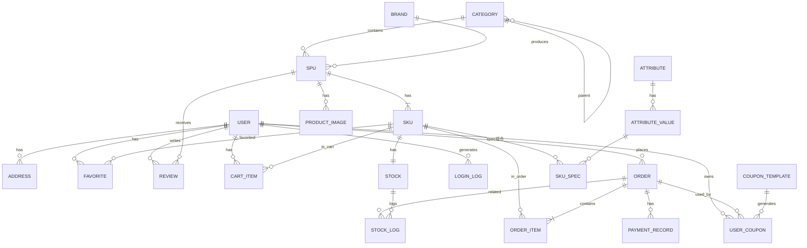

# 阶段一：需求和架构设计

> 本阶段只产出设计文档，不生成业务代码。确认设计后，再进入阶段二项目初始化。

---

## 1. 项目功能边界

### 1.1 本次实现范围（In Scope）

| 模块 | 核心功能 |
|------|----------|
| 用户认证 | 注册、登录、JWT Access/Refresh、退出、修改资料/密码、收货地址、角色权限 |
| 商品 | 分类树、品牌、SPU/SKU、规格属性、图片、库存、上下架、搜索筛选、收藏、评价 |
| 购物车 | 增删改查、选择/取消、价格计算、库存校验、Redis 读优化 + MySQL 最终一致 |
| 订单 | 创建、详情、列表、取消、模拟支付、发货、确认收货、超时自动取消、状态机 |
| 库存 | SKU 库存、锁定/释放、库存日志、条件更新 + 行锁防超卖 |
| 优惠券 | 模板管理、用户领取、有效期/门槛校验、使用、不可重复使用 |
| 支付 | 模拟支付、支付回调、幂等性处理、支付记录 |
| 后台管理 | Django Admin 运营后台 + 独立前端管理页面（用户/商品/订单/优惠券/评价/库存） |
| 工程化 | Docker Compose、Nginx、Gunicorn、.env、日志、健康检查、OpenAPI 文档、pytest 测试 |

### 1.2 暂不实现（Out of Scope）

- 真实第三方支付/物流/短信网关（用模拟回调代替）
- 复杂退款/退货售后完整工作流（仅预留字段和状态）
- 多租户、多语言、多币种
- 推荐算法、千人千面、搜索引擎（Elasticsearch）
- SSR / 移动端 App / 小程序
- 分布式事务（Seata/TCC），本项目用 MySQL 本地事务 + 补偿任务即可满足

---

## 2. 整体架构图

```text
+-----------------+        HTTPS         +-----------------------------+
|   用户浏览器     | -------------------> |           Nginx             |
|  (Vue 3 SPA)    | <------------------- |   静态资源 / 反向代理 / 限流  |
+-----------------+                      +-------------+---------------+
                                                       |
                         +-----------------------------+-----------------------------+
                         |                                                           |
             +-----------v-----------+                                  +------------v-----------+
             |   前端 (Vue 3 + Vite)  |                                  |  后端 (Django + DRF)   |
             |  Vue Router / Pinia   |                                  |  Gunicorn / 业务 App   |
             |   Axios / Element Plus |                                  |   JWT / Service 层     |
             +-----------------------+                                  +------------+-----------+
                                                                                     |
                                                              +----------------------+----------------------+
                                                              |                      |                      |
                                                    +---------v---------+  +---------v---------+  +--------v--------+
                                                    |    MySQL 8        |  |     Redis         |  |   RabbitMQ      |
                                                    |  业务数据/事务     |  |  缓存/锁/限流/Token |  |  Celery 消息代理 |
                                                    +-------------------+  +-------------------+  +-----------------+
                                                                                               |
                                                                                    +----------v----------+
                                                                                    | Celery Worker/Beat  |
                                                                                    | 异步任务/定时任务    |
                                                                                    +---------------------+
```

### 2.1 架构说明

- **前后端分离**：Vue 3 单页应用通过 Axios 调用 Django REST API，两者只通过 JSON 交互。
- **Nginx 入口**：统一处理 SSL 终止、静态资源分发、API 反向代理和基础限流，后端不直接对外暴露。
- **DRF 负责 RESTful API**：统一响应格式、分页、筛选、异常处理和 OpenAPI 文档。
- **MySQL 是主数据库**：所有核心业务数据持久化到这里，利用事务保证一致性。
- **Redis 是高速辅助存储**：缓存、限流、分布式锁、验证码、Refresh Token 黑名单、热门商品统计。
- **RabbitMQ + Celery**：解耦耗时/定时操作，例如发邮件、订单超时取消、库存释放、统计更新。

---

## 3. 前后端目录结构

### 3.1 后端 `backend/`

```text
backend/
├── config/                      # Django 全局配置
│   ├── __init__.py
│   ├── settings/                # 按环境拆分：base.py、dev.py、prod.py
│   │   ├── base.py
│   │   ├── dev.py
│   │   └── prod.py
│   ├── urls.py                  # 根路由，挂载各 App 路由和 API 文档
│   ├── wsgi.py
│   ├── asgi.py
│   └── celery.py                # Celery 应用配置
├── apps/                        # 业务应用（领域驱动拆分）
│   ├── __init__.py
│   ├── users/                   # 用户、角色、地址
│   │   ├── models.py
│   │   ├── serializers.py
│   │   ├── views.py
│   │   ├── services.py          # 注册/改密等复杂逻辑
│   │   ├── permissions.py
│   │   ├── urls.py
│   │   ├── admin.py
│   │   └── tests.py
│   ├── products/                # 分类、品牌、SPU、SKU、图片、属性、收藏、评价
│   │   ├── models.py
│   │   ├── serializers.py
│   │   ├── views.py
│   │   ├── selectors.py         # 复杂查询
│   │   ├── services.py
│   │   ├── urls.py
│   │   ├── admin.py
│   │   └── tests.py
│   ├── carts/                   # 购物车
│   │   ├── models.py
│   │   ├── serializers.py
│   │   ├── views.py
│   │   ├── services.py
│   │   ├── urls.py
│   │   └── tests.py
│   ├── orders/                  # 订单、订单项、状态机
│   │   ├── models.py
│   │   ├── serializers.py
│   │   ├── views.py
│   │   ├── services.py
│   │   ├── tasks.py             # 订单超时取消等 Celery 任务
│   │   ├── urls.py
│   │   ├── admin.py
│   │   └── tests.py
│   ├── inventory/               # 库存、库存日志
│   │   ├── models.py
│   │   ├── serializers.py
│   │   ├── views.py
│   │   ├── services.py
│   │   ├── urls.py
│   │   ├── admin.py
│   │   └── tests.py
│   ├── coupons/                 # 优惠券模板、用户优惠券
│   │   ├── models.py
│   │   ├── serializers.py
│   │   ├── views.py
│   │   ├── services.py
│   │   ├── urls.py
│   │   ├── admin.py
│   │   └── tests.py
│   ├── payments/                # 支付记录、模拟支付、回调
│   │   ├── models.py
│   │   ├── serializers.py
│   │   ├── views.py
│   │   ├── services.py
│   │   ├── urls.py
│   │   └── tests.py
│   └── common/                  # 通用工具、异常、响应、校验、模型基类
│       ├── __init__.py
│       ├── exceptions.py
│       ├── pagination.py
│       ├── response.py
│       ├── validators.py
│       ├── models.py
│       └── middleware.py
├── requirements/                # 按环境拆分依赖
│   ├── base.txt
│   ├── dev.txt
│   └── prod.txt
├── scripts/                     # 初始化、等待数据库等脚本
│   ├── wait_for_mysql.py
│   └── init_admin.py
├── logs/                        # 日志目录（Docker volume 挂载）
├── manage.py
├── Dockerfile
├── .env.example
├── .dockerignore
└── pytest.ini
```

### 3.2 前端 `frontend/`

```text
frontend/
├── public/
├── src/
│   ├── api/                     # 按模块封装的 Axios 接口
│   │   ├── auth.js
│   │   ├── user.js
│   │   ├── product.js
│   │   ├── cart.js
│   │   ├── order.js
│   │   ├── coupon.js
│   │   └── payment.js
│   ├── assets/                  # 图片、字体、全局样式
│   │   └── styles/
│   │       ├── variables.scss
│   │       └── global.scss
│   ├── components/              # 可复用组件
│   │   ├── AppHeader.vue
│   │   ├── AppFooter.vue
│   │   ├── ProductCard.vue
│   │   ├── Pagination.vue
│   │   ├── EmptyState.vue
│   │   └── Loading.vue
│   ├── composables/             # 通用组合式函数
│   │   ├── useAsync.js
│   │   └── useAuth.js
│   ├── layouts/                 # 布局组件
│   │   ├── DefaultLayout.vue
│   │   └── AdminLayout.vue
│   ├── router/                  # Vue Router
│   │   ├── index.js
│   │   └── guards.js
│   ├── stores/                  # Pinia 状态
│   │   ├── user.js
│   │   ├── cart.js
│   │   └── app.js
│   ├── utils/                   # 工具函数
│   │   ├── request.js           # Axios 实例 + 拦截器
│   │   ├── storage.js
│   │   └── format.js
│   ├── views/                   # 页面级组件
│   │   ├── home/
│   │   ├── auth/
│   │   ├── product/
│   │   ├── cart/
│   │   ├── order/
│   │   ├── user/
│   │   ├── admin/
│   │   └── error/
│   ├── App.vue
│   └── main.js
├── .env.example
├── .eslintrc.cjs
├── .prettierrc.cjs
├── index.html
├── package.json
├── vite.config.js
└── Dockerfile
```

---

## 4. Django App 划分

| App | 职责 | 包含模型（核心） |
|-----|------|-----------------|
| `users` | 用户、角色、收货地址、操作日志 | `User`、`Address`、`LoginLog` |
| `products` | 商品体系、收藏、评价 | `Category`、`Brand`、`Attribute`、`AttributeValue`、`SPU`、`SKU`、`ProductImage`、`Favorite`、`Review` |
| `carts` | 购物车数据持久化 | `CartItem` |
| `orders` | 订单、订单项、状态流转 | `Order`、`OrderItem` |
| `inventory` | SKU 库存与变更日志 | `Stock`、`StockLog` |
| `coupons` | 优惠券模板、用户优惠券 | `CouponTemplate`、`UserCoupon` |
| `payments` | 支付记录、回调幂等 | `PaymentRecord` |
| `common` | 通用异常、响应、分页、校验、中间件、基类 | — |

### 4.1 分层原则

- **Model**：只负责数据结构和基础约束（`Meta`、`unique_together`、`save` 钩子）。
- **Serializer**：负责入参校验和出参格式化，不写复杂业务查询。
- **View/ViewSet**：负责接收请求、调用 Service/Selector、返回响应，不写业务规则。
- **Service**：复杂业务逻辑（事务、跨模型操作），简单 CRUD 不写 Service。
- **Selector/Query Service**：复杂查询、列表筛选、聚合，避免在 Serializer 里拼 SQL。
- **Task**：Celery 异步任务，保持幂等。
- **Permission**：DRF 权限类，统一处理管理员/运营/普通用户权限。
- **Validator**：跨字段、跨模型的通用校验函数。
- **Exception**：业务异常 + 全局异常处理，返回统一响应格式。

---

## 5. 核心数据模型设计

### 5.1 用户模型

选择 **继承 `AbstractUser`** 而不是 `AbstractBaseUser`：

- `AbstractUser` 已经提供了 `username`、`email`、`password`、密码哈希、`is_staff`、`is_active`、权限组等成熟机制。
- 电商场景用邮箱/用户名登录即可满足，无需完全自定义用户认证流程。
- 扩展字段：`phone`、`avatar`、`role`、`created_at`、`updated_at`。

```python
class User(AbstractUser):
    class Role(models.TextChoices):
        CONSUMER = "consumer", "普通用户"
        OPERATOR = "operator", "运营人员"
        ADMIN = "admin", "管理员"

    phone = models.CharField("手机号", max_length=20, blank=True)
    avatar = models.URLField("头像", blank=True)
    role = models.CharField("角色", max_length=20, choices=Role.choices, default=Role.CONSUMER)
    updated_at = models.DateTimeField("更新时间", auto_now=True)
```

### 5.2 SPU 与 SKU 设计

- **SPU（Standard Product Unit）**：标准产品单元，描述一个商品的“概念”。例如 *iPhone 15*。
  - 包含：名称、副标题、分类、品牌、主图、详情、状态。
  - **不直接承载价格和库存**，价格和库存放在 SKU 上。
- **SKU（Stock Keeping Unit）**：库存量单位，描述一个可售卖的具体规格。例如 *iPhone 15 / 128GB / 黑色*。
  - 包含：所属 SPU、规格组合、售价、成本价、状态、是否默认。
  - 与库存表一对一。

这种设计的好处：

- 一个 SPU 下可以有多组规格（颜色 × 容量），避免商品表爆炸。
- 库存、价格、购物车、订单都精确到 SKU，防止“同款不同规格”混淆。
- 收藏/评价可以挂在 SPU 上（评价的是这款商品整体），订单项精确到 SKU。

### 5.3 库存模型

```python
class Stock(models.Model):
    sku = models.OneToOneField(SKU, on_delete=models.CASCADE, related_name="stock")
    quantity = models.PositiveIntegerField("实际库存", default=0)
    locked_quantity = models.PositiveIntegerField("锁定库存", default=0)
    version = models.PositiveIntegerField("乐观锁版本", default=0)
    updated_at = models.DateTimeField("更新时间", auto_now=True)
```

- `可用库存 = quantity - locked_quantity`。
- 创建订单时增加 `locked_quantity`（预留库存）。
- 支付成功后把 `locked_quantity` 转为实际扣减（`quantity -= 1`，`locked_quantity -= 1`）。
- 取消/超时订单时减少 `locked_quantity`（释放库存）。
- `version` 用于乐观锁更新；同时配合 `select_for_update()` 行锁防止并发扣减。

### 5.4 订单模型

```python
class Order(models.Model):
    class Status(models.TextChoices):
        PENDING_PAYMENT = "pending_payment", "待支付"
        PAID = "paid", "已支付"
        SHIPPED = "shipped", "已发货"
        COMPLETED = "completed", "已完成"
        CANCELLED = "cancelled", "已取消"
        REFUNDING = "refunding", "退款中"
        REFUNDED = "refunded", "已退款"

    order_no = models.CharField("订单编号", max_length=32, unique=True, db_index=True)
    user = models.ForeignKey(User, on_delete=models.CASCADE, related_name="orders")
    status = models.CharField("状态", max_length=20, choices=Status.choices, default=Status.PENDING_PAYMENT)
    total_amount = models.DecimalField("商品总金额", max_digits=12, decimal_places=2)
    discount_amount = models.DecimalField("优惠金额", max_digits=12, decimal_places=2, default=0)
    freight_amount = models.DecimalField("运费", max_digits=12, decimal_places=2, default=0)
    payable_amount = models.DecimalField("应付金额", max_digits=12, decimal_places=2)
    coupon = models.ForeignKey("coupons.UserCoupon", on_delete=models.SET_NULL, null=True, blank=True)
    address_snapshot = models.JSONField("收货地址快照")
    remark = models.CharField("备注", max_length=255, blank=True)
    paid_at = models.DateTimeField("支付时间", null=True, blank=True)
    shipped_at = models.DateTimeField("发货时间", null=True, blank=True)
    received_at = models.DateTimeField("收货时间", null=True, blank=True)
    cancelled_at = models.DateTimeField("取消时间", null=True, blank=True)
    created_at = models.DateTimeField("创建时间", auto_now_add=True)
    updated_at = models.DateTimeField("更新时间", auto_now=True)
```

- 订单金额全部使用 `DecimalField`，避免浮点误差。
- `address_snapshot` 用 JSON 保存下单瞬间的收货地址，防止地址修改后订单信息变化。
- 订单项保存 SKU 名称、规格、图片、单价快照，避免后续商品修改影响历史订单。

### 5.5 优惠券模型

```python
class CouponTemplate(models.Model):
    class Type(models.TextChoices):
        FIXED = "fixed", "固定金额"
        PERCENT = "percent", "折扣比例"

    name = models.CharField("名称", max_length=100)
    type = models.CharField("类型", max_length=20, choices=Type.choices)
    value = models.DecimalField("优惠值", max_digits=10, decimal_places=2)
    min_amount = models.DecimalField("最低使用金额", max_digits=12, decimal_places=2, default=0)
    total_quantity = models.PositiveIntegerField("总发行量")
    remaining_quantity = models.PositiveIntegerField("剩余量")
    valid_days = models.PositiveIntegerField("领取后有效天数")
    per_user_limit = models.PositiveIntegerField("每人限领", default=1)
    is_active = models.BooleanField("是否上架", default=True)

class UserCoupon(models.Model):
    class Status(models.TextChoices):
        UNUSED = "unused", "未使用"
        USED = "used", "已使用"
        EXPIRED = "expired", "已过期"

    user = models.ForeignKey(User, on_delete=models.CASCADE)
    template = models.ForeignKey(CouponTemplate, on_delete=models.CASCADE)
    code = models.CharField("券码", max_length=32, unique=True)
    status = models.CharField("状态", max_length=20, choices=Status.choices, default=Status.UNUSED)
    valid_start = models.DateTimeField("有效开始")
    valid_end = models.DateTimeField("有效结束")
    used_at = models.DateTimeField("使用时间", null=True, blank=True)
    order = models.ForeignKey(Order, on_delete=models.SET_NULL, null=True, blank=True)
```

---

## 6. 数据表关系说明



### 6.1 关键关系说明

- `Category` 自关联：实现多级分类树，通过 `parent` 和 `level` 字段。
- `SPU` 与 `SKU` 一对多：SPU 决定商品展示，SKU 决定具体购买。
- `SKU` 与 `Stock` 一对一：库存精确到 SKU。
- `SKU` 与 `AttributeValue` 多对多：通过中间表 `SKU_SPEC` 记录具体规格组合。
- `Order` 与 `OrderItem` 一对多：订单项保存快照，避免商品后续变更影响历史订单。
- `Order` 与 `UserCoupon` 一对一：记录订单使用的优惠券，保证不可重复使用。

---

## 7. API 列表

统一前缀：`/api/v1/`

### 7.1 认证模块 `/auth/`

| 方法 | 路径 | 权限 | 说明 |
|------|------|------|------|
| POST | `/auth/register/` | 匿名 | 用户注册，发送验证邮件 |
| POST | `/auth/login/` | 匿名 | 登录，返回 Access + Refresh Token |
| POST | `/auth/token/refresh/` | 需 Refresh | 刷新 Access Token |
| POST | `/auth/logout/` | 需登录 | 将 Refresh Token 加入 Redis 黑名单 |
| POST | `/auth/password/reset/` | 匿名 | 发送找回密码邮件 |
| POST | `/auth/password/reset-confirm/` | 匿名 | 使用验证码重置密码 |

### 7.2 用户模块 `/users/`

| 方法 | 路径 | 权限 | 说明 |
|------|------|------|------|
| GET | `/users/me/` | 登录 | 获取当前用户信息 |
| PUT/PATCH | `/users/me/` | 登录 | 修改个人资料 |
| POST | `/users/change-password/` | 登录 | 修改密码 |
| GET | `/users/addresses/` | 登录 | 收货地址列表 |
| POST | `/users/addresses/` | 登录 | 新增收货地址 |
| PUT | `/users/addresses/{id}/` | 登录 | 修改收货地址 |
| DELETE | `/users/addresses/{id}/` | 登录 | 删除收货地址 |
| PUT | `/users/addresses/{id}/default/` | 登录 | 设为默认地址 |
| GET | `/users/favorites/` | 登录 | 收藏列表 |
| POST | `/users/favorites/` | 登录 | 添加收藏 |
| DELETE | `/users/favorites/{sku_id}/` | 登录 | 取消收藏 |

### 7.3 商品模块 `/products/`

| 方法 | 路径 | 权限 | 说明 |
|------|------|------|------|
| GET | `/products/categories/` | 公开 | 分类树 |
| GET | `/products/brands/` | 公开 | 品牌列表 |
| GET | `/products/` | 公开 | 商品 SPU 列表（搜索/筛选/排序/分页） |
| GET | `/products/{id}/` | 公开 | SPU 详情 |
| GET | `/products/{id}/skus/` | 公开 | SPU 下 SKU 列表 |
| GET | `/products/{id}/reviews/` | 公开 | 商品评价列表 |
| GET | `/skus/{id}/` | 公开 | SKU 详情（含库存） |
| POST | `/products/{id}/reviews/` | 登录 | 发表评价 |
| GET | `/products/hot/` | 公开 | 热门商品 |
| GET | `/products/new/` | 公开 | 新品推荐 |

### 7.4 购物车模块 `/carts/`

| 方法 | 路径 | 权限 | 说明 |
|------|------|------|------|
| GET | `/carts/` | 登录 | 查询购物车 |
| POST | `/carts/items/` | 登录 | 添加商品 |
| PUT | `/carts/items/{id}/` | 登录 | 修改数量/选择状态 |
| DELETE | `/carts/items/{id}/` | 登录 | 删除商品 |
| POST | `/carts/select/` | 登录 | 批量选择/取消 |

### 7.5 优惠券模块 `/coupons/`

| 方法 | 路径 | 权限 | 说明 |
|------|------|------|------|
| GET | `/coupons/` | 登录 | 可领取优惠券列表 |
| POST | `/coupons/{id}/claim/` | 登录 | 领取优惠券 |
| GET | `/users/coupons/` | 登录 | 我的优惠券 |
| POST | `/orders/calculate/` | 登录 | 计算订单金额（含优惠券） |

### 7.6 订单模块 `/orders/`

| 方法 | 路径 | 权限 | 说明 |
|------|------|------|------|
| POST | `/orders/` | 登录 | 创建订单（事务 + 锁） |
| GET | `/orders/` | 登录 | 订单列表 |
| GET | `/orders/{order_no}/` | 登录 | 订单详情 |
| POST | `/orders/{order_no}/cancel/` | 登录 | 取消订单 |
| POST | `/orders/{order_no}/pay/` | 登录 | 模拟支付 |
| POST | `/orders/{order_no}/ship/` | 运营/管理员 | 发货 |
| POST | `/orders/{order_no}/confirm/` | 登录 | 确认收货 |

### 7.7 支付模块 `/payments/`

| 方法 | 路径 | 权限 | 说明 |
|------|------|------|------|
| POST | `/payments/callback/` | 内部/模拟 | 模拟支付回调，幂等处理 |

### 7.8 管理模块 `/admin/` 与 Django Admin

- 普通运营人员使用 Django Admin 管理商品、分类、品牌、SKU、库存、优惠券、订单、评价。
- 独立前端管理页面提供订单看板、库存看板、用户列表等，通过 DRF 管理接口访问。

### 7.9 健康检查 `/health/`

| 方法 | 路径 | 权限 | 说明 |
|------|------|------|------|
| GET | `/health/` | 公开 | 检查 Django、MySQL、Redis、Celery 状态 |

---

## 8. Redis 使用方案

### 8.1 缓存

| 数据 | Key 示例 | TTL | 失效策略 |
|------|----------|-----|----------|
| 分类树 | `cache:category:tree` | 30 分钟 | 后台更新分类时删除 |
| 商品列表 | `cache:product:list:{params_hash}` | 5 分钟 | 主动失效 + 自然过期 |
| 商品详情 | `cache:product:detail:{spu_id}` | 10 分钟 | 商品更新时删除 |
| 热门商品 | `cache:product:hot` | 10 分钟 | 定时任务刷新 |

缓存原则：

- 读多写少的商品数据优先缓存。
- 写操作后主动删除缓存（Cache Aside），而不是更新缓存，避免并发脏写。
- 缓存 key 加入版本号或参数哈希，防止 key 冲突。

### 8.2 验证码与临时数据

| 数据 | Key 示例 | TTL |
|------|----------|-----|
| 注册验证码 | `verify:register:{email}` | 5 分钟 |
| 重置密码验证码 | `verify:password_reset:{email}` | 5 分钟 |
| 短信验证码 | `verify:sms:{phone}` | 5 分钟 |

### 8.3 登录状态辅助管理

- Refresh Token 使用 `jti` 唯一标识，存于 Redis：`refresh_token:{jti} -> user_id`，TTL 与 Token 过期时间一致。
- 退出登录时把该 `jti` 加入黑名单集合：`refresh_token_blacklist`，Access Token 校验时检查。

### 8.4 分布式锁

- 场景：创建订单、领取优惠券、库存扣减。
- 实现：`SET lock:order:create:{user_id} {uuid} NX EX 30`。
- 释放：使用 Lua 脚本保证原子性判断 value 再删除。
- 防止重复提交：订单创建接口要求客户端传 `idempotency_key`，服务端用 Redis 锁 + 已处理结果缓存。

### 8.5 限流计数

- 登录失败限流：`rate:login:fail:{ip}`，5 分钟内失败超过 5 次则锁定 15 分钟。
- 接口限流：`rate:api:{user_id}:{path}`，使用滑动窗口计数，返回 429。

### 8.6 热门商品数据

- 使用 Redis Sorted Set：`zincrby hot:products 1 {spu_id}`。
- Celery 定时任务把 Sorted Set 数据同步到 MySQL 或刷新缓存。

### 8.7 购物车读优化

- 登录用户购物车持久化在 MySQL。
- 读取时把当前用户购物车商品摘要写入 Redis：`cart:summary:{user_id}`，TTL 5 分钟。
- 购物车增删改时删除 Redis 摘要，下次读取重新生成。

---

## 9. Celery 和 RabbitMQ 使用方案

### 9.1 角色分工

- **RabbitMQ**：Celery 的 Broker，负责接收和分发任务消息。
- **Redis**：Celery 的 Result Backend，存储任务结果（可选，异步任务通常 fire-and-forget）。
- **Celery Worker**：消费任务并执行。
- **Celery Beat**：定时任务调度器。

### 9.2 任务清单

| 任务 | 触发方式 | 说明 |
|------|----------|------|
| `send_register_email` | 注册后 `delay` | 发送验证邮件 |
| `send_order_notification_email` | 支付成功后 `delay` | 发送订单通知 |
| `auto_cancel_unpaid_orders` | Beat 每 5 分钟 | 扫描超时未支付订单并取消 |
| `release_locked_stock` | 取消/超时后 `delay` | 释放锁定库存 |
| `update_product_sales_stats` | Beat 每小时 / 支付后 | 刷新销量和热门商品统计 |
| `async_admin_operation_log` | 管理操作后 `delay` | 异步写入管理员操作日志 |
| `async_payment_callback_log` | 回调后 `delay` | 异步记录支付回调日志 |

### 9.3 消息流转过程

1. 视图调用 `task.delay(args)`。
2. Celery 将任务序列化为消息，发送到 RabbitMQ 的默认 Exchange/Queue。
3. Celery Worker 从队列拉取消息，反序列化后执行任务函数。
4. 若配置了 Result Backend，执行结果写回 Redis。
5. 任务执行失败时，Celery 按配置重试（`max_retries`、`default_retry_delay`）。

### 9.4 幂等性

- 任务内部使用 Redis `SETNX` 判断是否已经处理过相同 `task_id` 或业务唯一键。
- 例如超时取消任务：以 `order_no` 为幂等键，确保同一订单不会被多次取消。

---

## 10. 订单与库存一致性方案

### 10.1 核心流程

1. 用户提交订单，传入 `sku_id`、`quantity`、`address_id`、`coupon_id`、`idempotency_key`。
2. 后端先用 Redis 分布式锁（`lock:order:create:{user_id}:{idempotency_key}`）防止重复提交。
3. 在 `transaction.atomic()` 中：
   - 查询 SKU、SPU 状态，校验上下架。
   - 使用 `select_for_update()` 锁定对应 `Stock` 行。
   - 检查 `available_stock = quantity - locked_quantity` 是否足够。
   - 增加 `locked_quantity`。
   - 创建 `Order` 和 `OrderItem`，写入价格/规格快照。
   - 创建 `StockLog` 记录锁定变更。
4. 事务提交后，发送订单创建成功响应，并启动 Celery 超时取消任务。

### 10.2 状态流转

```text
待支付 -> 已支付 -> 已发货 -> 已完成
  |
  +-> 已取消（用户取消 / 超时自动取消）
  |
  +-> 退款中 -> 已退款（预留）
```

### 10.3 超时取消

- Celery Beat 每 5 分钟扫描 `status=pending_payment` 且 `created_at < now() - TTL` 的订单。
- 取消订单：回退 `locked_quantity`，更新订单状态，记录日志。
- 释放库存操作本身也放在 `transaction.atomic()` 中。

### 10.4 支付回调幂等

- 每个 `PaymentRecord` 使用唯一的 `payment_no`。
- 回调接口先查询订单状态：
  - 如果已经是 `paid`，直接返回成功，不做任何修改。
  - 如果是 `pending_payment`，在事务中更新订单状态、扣减实际库存（`quantity -= locked`）、记录支付时间、创建支付记录。
- 回调日志完整保存原始数据，便于对账。

### 10.5 为什么需要事务

订单创建涉及：订单主表、订单项表、库存表、库存日志表、优惠券表。如果不用事务：

- 库存扣减成功但订单项写入失败，会导致库存被扣但无订单。
- 订单创建成功但优惠券未标记使用，会导致优惠券被重复利用。

MySQL 本地事务保证这些操作要么全部成功，要么全部回滚。

### 10.6 如何防止超卖

- **行锁**：`select_for_update()` 让同一 SKU 的并发订单串行化。
- **条件更新**：更新库存时使用 `WHERE available_stock >= quantity`，若影响行数为 0 则返回库存不足。
- **锁定库存机制**：库存不会立刻从 `quantity` 扣减，而是先锁定；支付成功后再真正扣减，超时/取消则释放。
- 这三层防护分别阻止了：并发同时读到足够库存、并发更新导致负数、以及未支付订单长期占用库存。

---

## 11. 项目开发阶段划分

| 阶段 | 目标 | 主要产出 |
|------|------|----------|
| 一 | 需求和架构设计 | 本文档：功能边界、架构图、模型、API 列表、技术方案 |
| 二 | 项目初始化 | Django + Vue 项目骨架、Docker Compose、.env、日志、OpenAPI、健康检查 |
| 三 | 用户和认证模块 | 注册/登录/JWT/刷新/退出/权限/前端登录页 |
| 四 | 商品模块 | 分类/SPU/SKU/库存/搜索/筛选/商品详情页 |
| 五 | 购物车模块 | 购物车 API、Redis 优化、前端购物车页 |
| 六 | 订单与库存模块 | 订单创建/事务/防超卖/状态机/前端订单页 |
| 七 | Celery 异步任务 | 邮件/超时取消/库存释放/统计任务 |
| 八 | 优惠券、评价和收藏 | 优惠券领取使用、评价、收藏、前端页面 |
| 九 | 测试和安全检查 | pytest 测试、权限检查、漏洞修复、数据一致性验证 |
| 十 | 部署 | Nginx/Gunicorn/Docker 生产配置、部署文档、README |

---

## 12. 本阶段仍需确认的问题

在继续阶段二之前，建议确认以下设计：

1. 用户登录方式是否只用“邮箱 + 密码”，还是同时支持“用户名 + 密码”？
2. 优惠券是否只支持“满减”和“折扣”两种类型？是否需要支持叠加使用？
3. 是否需要真实的邮件发送服务（SMTP），还是开发阶段仅打印到控制台？
4. 支付是否只需要模拟支付回调，不需要对接真实支付网关？

这些确认后，阶段二将严格按本设计落地。
